# CSU-CampusMind

融合检索增强生成与工具调用的CSU校园智能体助手。

---

## 📌 快速导航

- [✨ 核心功能](#-核心功能)
- [🖼️ 界面预览](#️-界面预览)
- [🛠️ 技术栈](#️-技术栈)
- [🚀 快速开始](#-快速开始)
- [📂 项目结构](#-项目结构)
- [🤖 Agent 工具](#-agent-工具)
- [📝 开发与规范](#-开发与规范)

---

## ✨ 核心功能

- **多端支持** — 提供跨平台移动端（iOS / Android）及 Web 端应用。
- **智能问答** — 基于 LLM 的校园信息深度咨询，支持流式 (SSE) 输出。
- **RAG 知识库** — 支持个人/公共知识库构建，通过向量检索增强回答准确性。
- **系统集成** — 对接教务 (JWC)、图书馆、就业中心、OA 办公系统。
- **多轮会话** — 完善的上下文管理，支持会话历史持久化
- **自动化采集** — 集成网页抓取工具，支持在线向量化索引校园新闻与公告。

---

## 🖼️ 界面预览

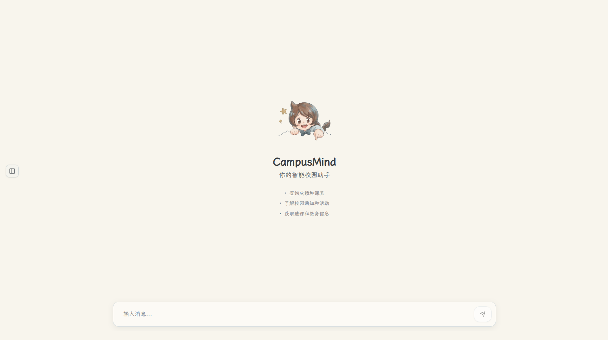

<details>
<summary><b>点击展开 Web 端截图</b></summary>

| 登录界面 | 个人 RAG 知识库 |
| :---: | :---: |
| 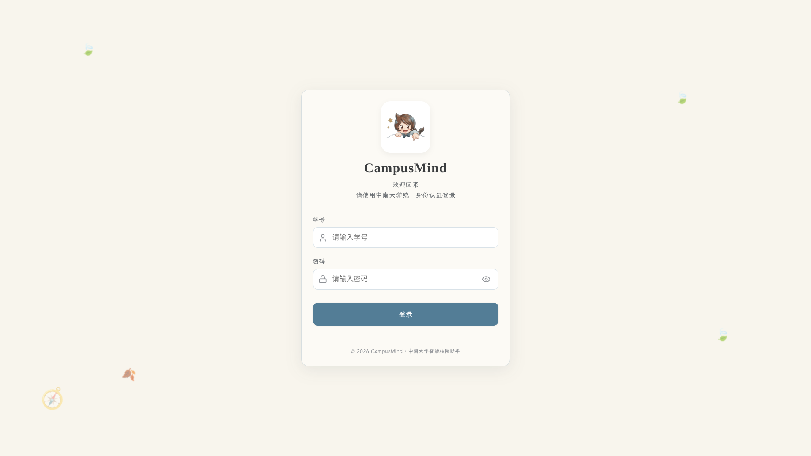 | 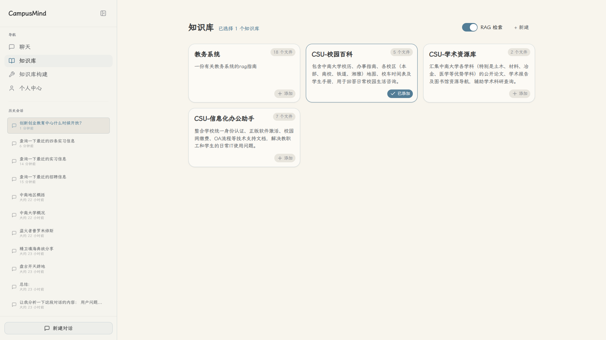 |

| 构建知识库 | 在线爬取 |
| :---: | :---: |
| 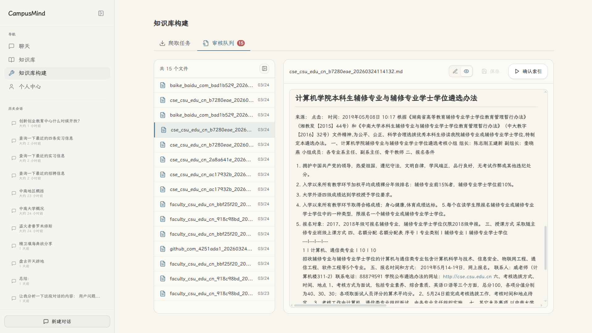 | 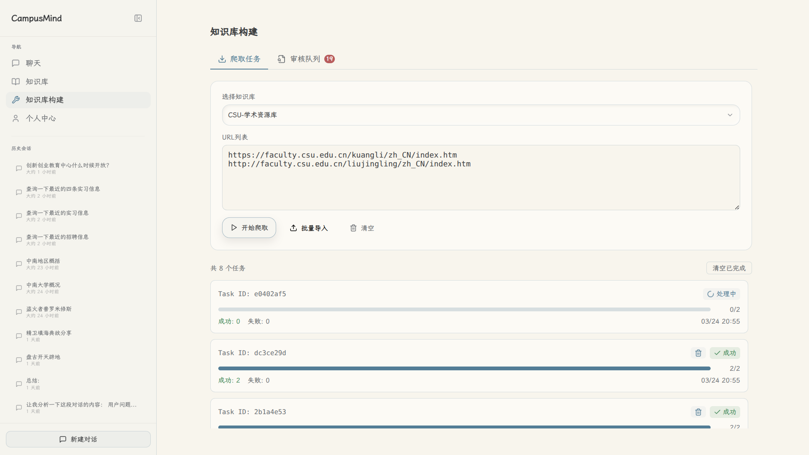 |

| 对话示例 1 | 对话示例 2 |
| :---: | :---: |
| 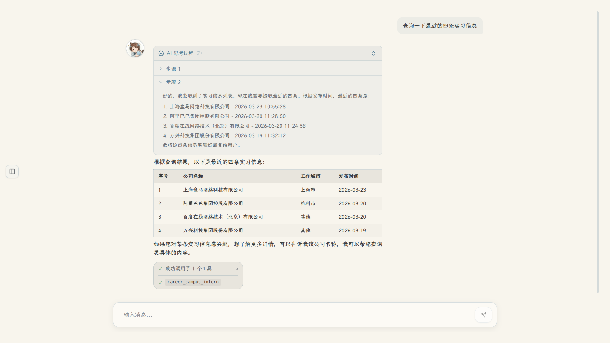 | 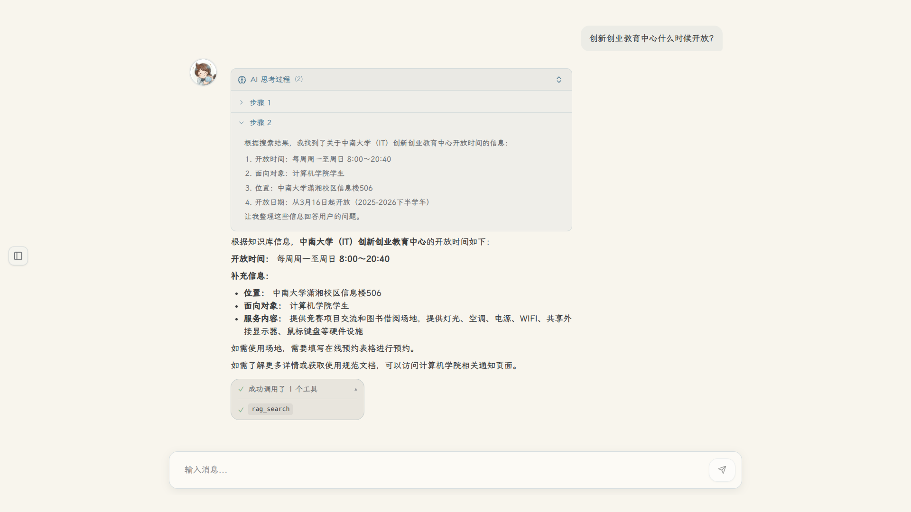 |

</details>

<details>
<summary><b>点击展开移动端截图</b></summary>

| 首页 | 聊天 |
| :---: | :---: |
| 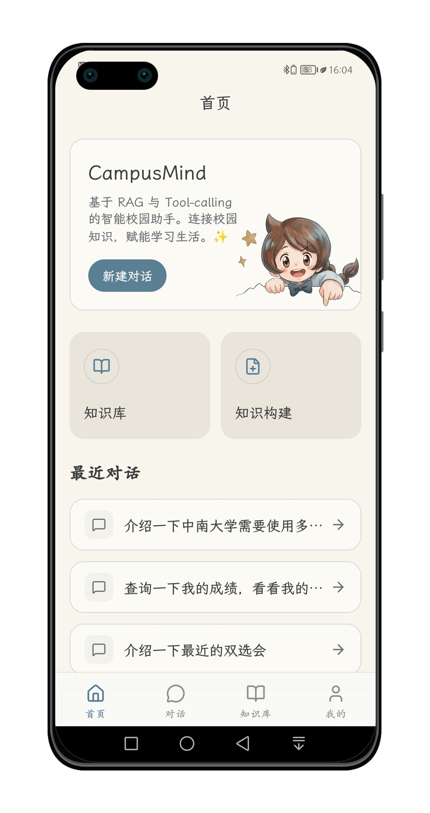 | 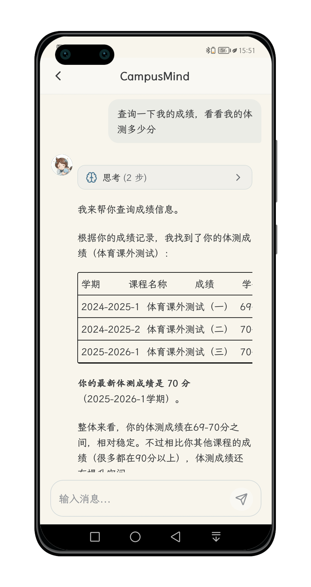 |

| 知识大纲 | 个人主页 |
| :---: | :---: |
| 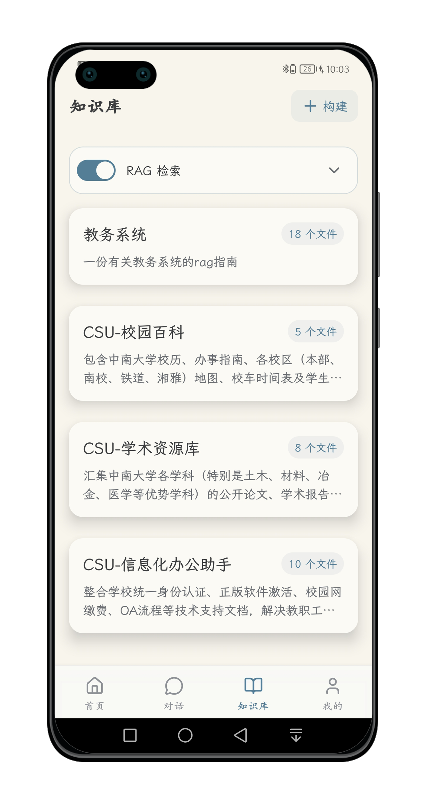 | 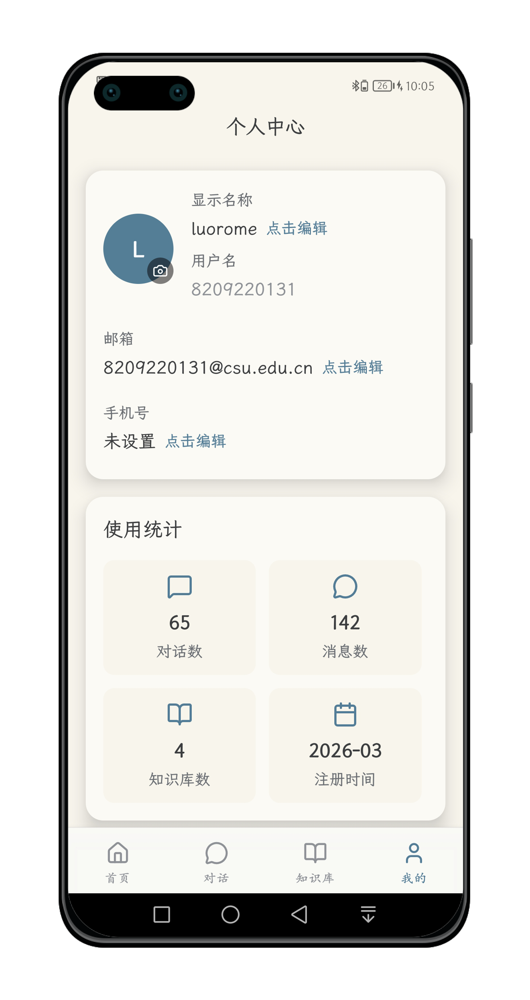 |

| 网页爬取 | 文件解析 |
| :---: | :---: |
| 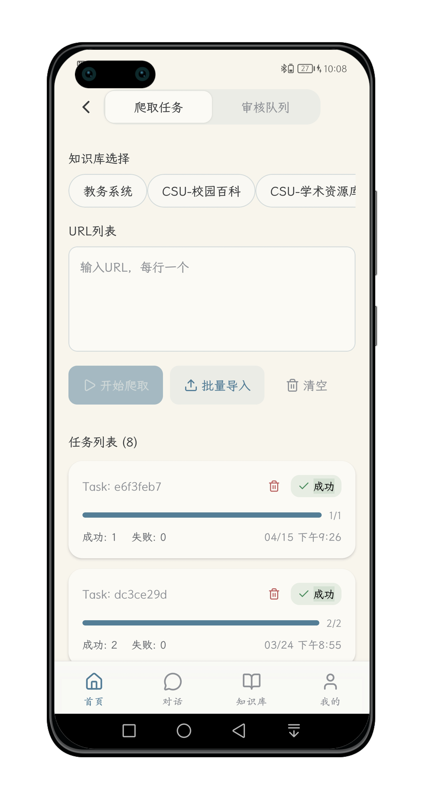 | 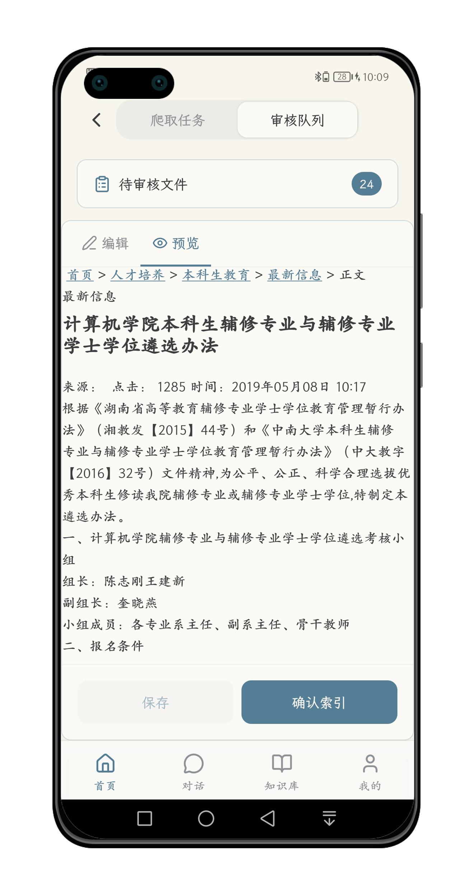 |

</details>

---

## 🛠️ 技术栈

| 层级 | 前端 (Web) | 前端 (Mobile) | 后端 |
|------|------|------|------|
| **核心框架** | React 18 + Vite | React Native 0.76 + Expo 52 | FastAPI |
| **编程语言** | TypeScript 5.x | TypeScript 5.x | Python 3.11+ |
| **状态/路由** | Zustand 5.x + React Router 6 | Zustand + React Navigation 7 | LangGraph (Agentic Workflow) |
| **数据库** | — | — | PostgreSQL / SQLite(测试环境) |
| **缓存/知识库存储** | — | — | Redis + ChromaDB / Elasticsearch |
| **文件存储** | — | — | MinIO |
| **字体** | [LXGW WenKai](https://github.com/lxgw/LxgwWenKai-Screen/releases) | [LXGW WenKai Screen](https://github.com/chawyehsu/lxgw-wenkai-screen-webfont) | — |

---

## 🚀 快速开始

### 1. 克隆与配置

```bash
git clone https://github.com/luorome31/CSU-CampusMind.git
cd CampusMind
```

- **前端**: `cd frontend && cp .env.example .env.local` (配置 `VITE_API_BASE_URL`)
- **移动端**: `cd mobile && cp .env.example .env.local` (配置 `VITE_API_BASE_URL`)
- **后端**: `cd backend && cp .env.example .env` (需配置 DB, Redis, 以及 LLM API Key等内容)
- **后端依赖脚本**: `./scripts/manage_deps.sh start`(依赖docker环境配置DB/Redis/MinIO/Elasticsearch)
### 2. 环境搭建

```bash
# 前端 (Web) 依赖
cd frontend && npm install

# 前端 (Mobile) 依赖
cd mobile && npm install

# 后端依赖
cd backend && uv sync
# 后端API交互文档请访问: `http://localhost:8000/docs`
```

### 3. 启动服务

```bash
# 前端 Web (localhost:5173)
cd frontend && npm run dev

# 前端 Mobile (Expo)
cd mobile && npm start

# 后端 (localhost:8000)
cd backend && uv run uvicorn app.main:app --host [IP_ADDRESS] --reload
# ex: cd backend && uv run uvicorn app.main:app --host 0.0.0.0 --reload
```
---

## 📂 项目结构

```bash
CampusMind/
├── mobile/                      # React Native + Expo 移动端
│   ├── src/
│   │   ├── api/               # 移动端 API 客户端
│   │   ├── components/        # 移动端 UI 组件
│   │   ├── navigation/        # 导航配置
│   │   ├── screens/           # 页面级组件
│   │   └── stores/            # Zustand 状态管理
│
├── frontend/                    # React + TypeScript Web 前端
│   ├── src/
│   │   ├── api/               # Web 端 API 客户端
│   │   ├── components/        # UI 组件 (ui/, layout/, chat/)
│   │   ├── features/          # 功能模块 (auth/, chat/, knowledge/, build/)
│   │   └── styles/            # 设计令牌
│
├── backend/                    # FastAPI + Python 后端
│   ├── app/
│   │   ├── api/v1/           # API 路由 (auth, completion, knowledge, crawl)
│   │   ├── core/
│   │   │   ├── agents/       # LangGraph ReAct Agent
│   │   │   ├── session/      # 会话管理 + CAS 登录
│   │   │   └── tools/        # 工具集成 (JWC, Library, Career, OA)
│   │   └── services/
│   │       ├── rag/          # RAG 管道
│   │       ├── knowledge/    # 知识库服务
│   │       └── crawl/        # 网页抓取服务
│   └── tests/                # pytest 测试
│
├── assets/                    # 项目截图
├── docs/                      # 项目文档
└── scripts/                   # 运维与自动化脚本
    └── manage_deps.sh         # 依赖环境管理脚本(需要docker环境)
```

---

## 🤖 Agent 工具

- **教务系统**: 成绩查询、课表拉取、排名分析
- **图书馆**: 馆藏图书检索、图书状态查询
- **就业指导中心**: 宣讲会与招聘信息查询
- **校内 OA**: 校内通知
- **个人知识库RAG**: 基于知识库的检索服务
---

## 📝 开发与规范

- **测试**: 
  - 前端 (Web): `npm run test:run`
  - 前端 (Mobile): `npm run test:run`
  - 后端: `pytest`
- **规范**: 
  - 使用 `Ruff` 格式化 Python 代码。
  - Git 提交前通过 `Lefthook` 进行 Lint 校验。

---

## 📄 版权声明


本项目代码仅供学习研究使用，严禁用于商业用途。

Copyright © 2026 **CSU-CampusMind**. All Rights Reserved.
