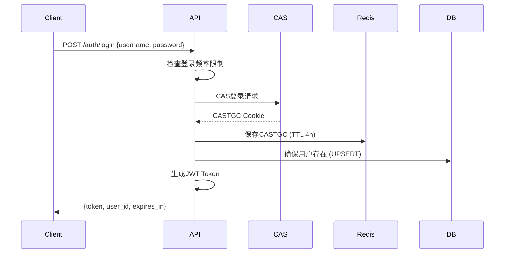
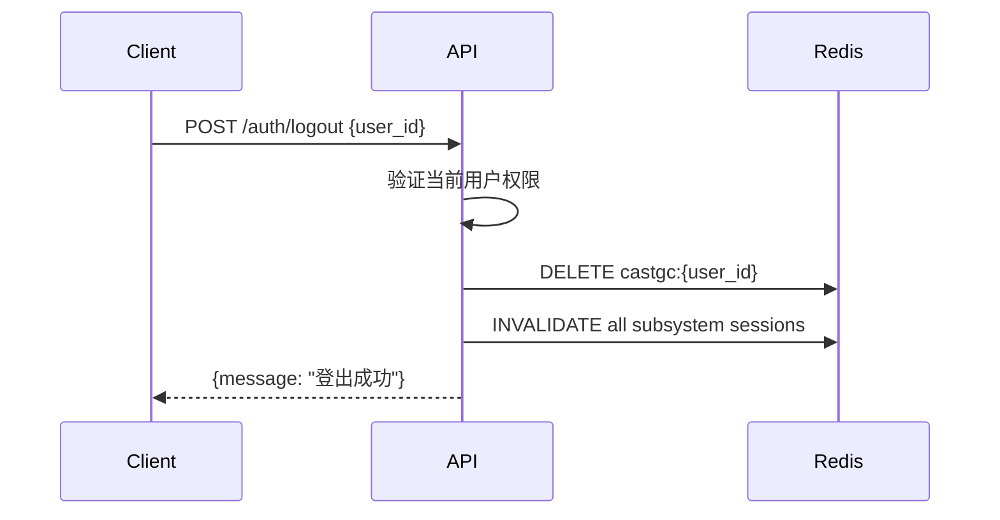
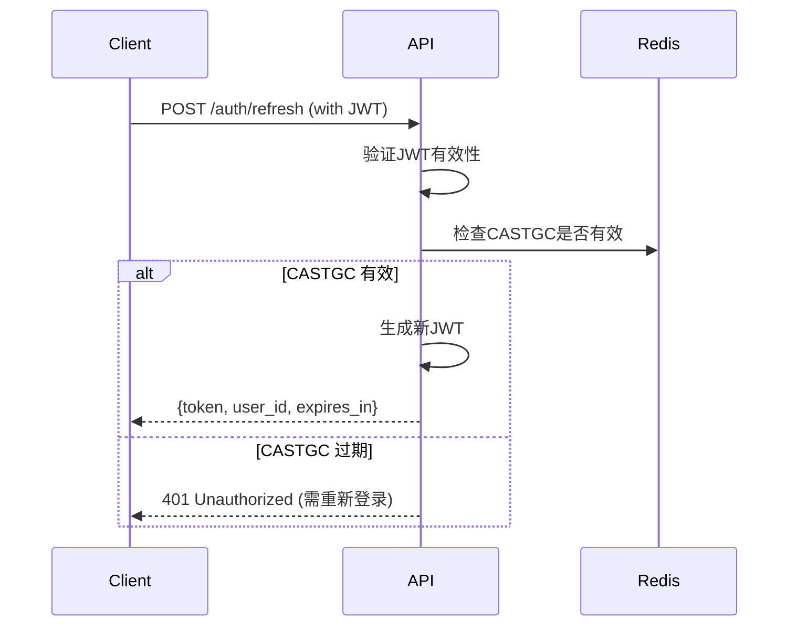
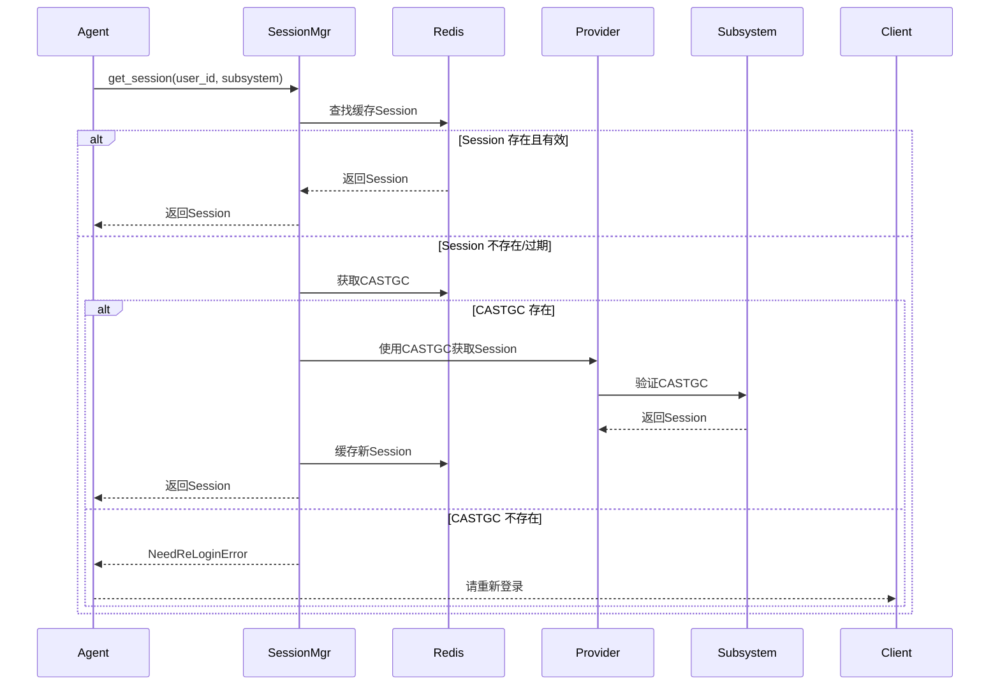

# 认证流程

## 登录流程



### 详细步骤

1. **频率检查**: `LoginRateLimiter.can_login(username)`
2. **CAS 认证**: `cas_login_only_castgc(username, password)`
3. **CASTGC 存储**: Redis SETEX `castgc:{user_id}`
4. **用户创建**: `INSERT ... ON CONFLICT DO NOTHING`
5. **JWT 生成**: `jwt_manager.create_token({"user_id": username})`

---

## 登出流程



---

## Token 刷新流程



---

## 工具调用时的 Session 获取



---

## 错误处理

| 错误类型 | 原因 | 处理方式 |
|----------|------|----------|
| `CASLoginError` | 用户名/密码错误 | 提示重新输入 |
| `AccountLockedError` | 账号被锁定 | 返回 423，提示联系管理员 |
| `NeedReLoginError` | CASTGC 过期 | 引导用户重新登录 |
| `LoginRateLimitError` | 登录过于频繁 | 等待后重试 |

---

## 前端集成建议

### 登录状态维护

```javascript
// 存储 Token
localStorage.setItem('token', response.token)

// 请求拦截器
axios.interceptors.request.use(config => {
  const token = localStorage.getItem('token')
  if (token) {
    config.headers.Authorization = `Bearer ${token}`
  }
  return config
})

// 401 处理
axios.interceptors.response.use(
  response => response,
  error => {
    if (error.response?.status === 401) {
      // Token 过期，引导重新登录
      router.push('/login')
    }
    return Promise.reject(error)
  }
)
```

### 登录频率限制提示

```javascript
try {
  await login(username, password)
} catch (error) {
  if (error.response?.status === 429) {
    const waitTime = extractWaitTime(error.response.data.detail)
    showMessage(`登录过于频繁，请等待 ${waitTime} 秒`)
  }
}
```
