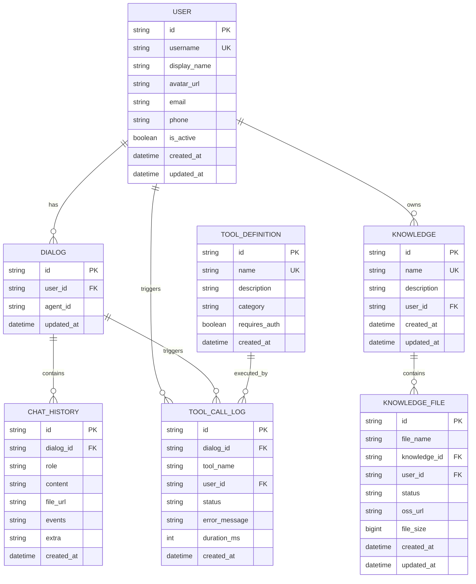

# CampusMind 数据库设计文档

> 版本: v2.0 (精简版)
> 日期: 2026-03-19
> 状态: 指导开发

---

## 1. 概述

### 1.1 设计原则

- **最小化**: 只存储必要的数据，不过度设计
- **实用性**: 每一张表、每一个字段都有明确用途
- **按需计算**: 不存储可推导的冗余数据

### 1.2 技术选型

| 组件 | 技术 | 说明 |
|------|------|------|
| 主数据库 | PostgreSQL | 生产环境 |
| 测试数据库 | SQLite | 开发/测试环境 |
| ORM | SQLModel | SQLAlchemy + Pydantic |
| 向量存储 | ChromaDB | 余弦相似度检索 |
| 全文检索 | Elasticsearch 8.18 | BM25 关键词检索 |
| 对象存储 | MinIO / OSS | 文件存储 |
| Session 存储 | 文件/NFS | 多实例部署用 Redis |

### 1.3 ER 关系图



---

## 2. 表结构详细设计

### 2.1 用户表 (users)

```sql
CREATE TABLE users (
    id TEXT PRIMARY KEY,
    username TEXT NOT NULL UNIQUE,
    display_name TEXT,
    avatar_url TEXT,
    email TEXT,
    phone TEXT,
    is_active BOOLEAN DEFAULT TRUE,
    created_at TIMESTAMP DEFAULT CURRENT_TIMESTAMP,
    updated_at TIMESTAMP DEFAULT CURRENT_TIMESTAMP
);
```

**字段说明:**

| 字段 | 类型 | 说明 |
|------|------|------|
| id | TEXT | 主键，使用 CAS 学号/工号 |
| username | TEXT | 唯一用户名 |

---

### 2.2 对话表 (dialogs)

```sql
CREATE TABLE dialogs (
    id TEXT PRIMARY KEY,
    user_id TEXT NOT NULL,
    agent_id TEXT,
    updated_at TIMESTAMP DEFAULT CURRENT_TIMESTAMP,
    FOREIGN KEY (user_id) REFERENCES users(id) ON DELETE CASCADE
);
```

---

### 2.3 聊天历史表 (chat_history)

```sql
CREATE TABLE chat_history (
    id TEXT PRIMARY KEY,
    dialog_id TEXT NOT NULL,
    role TEXT NOT NULL,
    content TEXT NOT NULL,
    file_url TEXT,
    events TEXT,
    extra TEXT,
    parent_id TEXT,
    created_at TIMESTAMP DEFAULT CURRENT_TIMESTAMP,
    FOREIGN KEY (dialog_id) REFERENCES dialogs(id) ON DELETE CASCADE
);
```

**字段说明:**

| 字段 | 类型 | 说明 |
|------|------|------|
| events | TEXT | 工具调用事件链，用于 SSE 推送 |
| extra | TEXT | 性能数据: tokens, model, latency |

---

### 2.4 知识库表 (knowledge_bases)

```sql
CREATE TABLE knowledge_bases (
    id TEXT PRIMARY KEY,
    name TEXT NOT NULL,
    description TEXT,
    user_id TEXT NOT NULL,
    created_at TIMESTAMP DEFAULT CURRENT_TIMESTAMP,
    updated_at TIMESTAMP DEFAULT CURRENT_TIMESTAMP,
    FOREIGN KEY (user_id) REFERENCES users(id) ON DELETE CASCADE,
    UNIQUE(name, user_id)
);
```

---

### 2.5 知识文件表 (knowledge_files)

```sql
CREATE TABLE knowledge_files (
    id TEXT PRIMARY KEY,
    file_name TEXT NOT NULL,
    knowledge_id TEXT NOT NULL,
    user_id TEXT NOT NULL,
    status TEXT DEFAULT 'pending',
    oss_url TEXT NOT NULL,
    file_size BIGINT DEFAULT 0,
    created_at TIMESTAMP DEFAULT CURRENT_TIMESTAMP,
    updated_at TIMESTAMP DEFAULT CURRENT_TIMESTAMP,
    FOREIGN KEY (knowledge_id) REFERENCES knowledge_bases(id) ON DELETE CASCADE,
    FOREIGN KEY (user_id) REFERENCES users(id) ON DELETE CASCADE
);
```

**状态值:** `pending`, `processing`, `success`, `failed`

---

### 2.6 工具定义表 (tool_definitions)

```sql
CREATE TABLE tool_definitions (
    id TEXT PRIMARY KEY,
    name TEXT NOT NULL UNIQUE,
    description TEXT,
    category TEXT,
    requires_auth BOOLEAN DEFAULT FALSE,
    created_at TIMESTAMP DEFAULT CURRENT_TIMESTAMP
);
```

**字段说明:**

| 字段 | 类型 | 说明 |
|------|------|------|
| category | TEXT | 分类: library/career/jwc/oa/rag |
| requires_auth | BOOLEAN | 是否需要认证 |

---

### 2.7 工具调用日志表 (tool_call_logs)

```sql
CREATE TABLE tool_call_logs (
    id TEXT PRIMARY KEY,
    dialog_id TEXT,
    tool_name TEXT NOT NULL,
    user_id TEXT NOT NULL,
    status TEXT NOT NULL,
    error_message TEXT,
    duration_ms INTEGER,
    created_at TIMESTAMP DEFAULT CURRENT_TIMESTAMP
);
```

**状态值:** `success`, `failed`, `timeout`

---

## 3. 索引策略

| 表 | 索引 | 用途 |
|----|------|------|
| users | idx_users_username | 用户名查找 |
| dialogs | idx_dialogs_user_id, idx_dialogs_updated_at | 用户对话列表 |
| chat_history | idx_chat_history_dialog_created | 消息分页查询 |
| knowledge_bases | idx_kb_user_id | 用户知识库列表 |
| knowledge_files | idx_kf_knowledge_id, idx_kf_status | 文件查询 |
| tool_call_logs | idx_tcl_user_created, idx_tcl_tool_name | 调用统计 |

---

## 4. Session 管理 (无需数据库表)

```
当前架构:
┌─────────────────────────────────────────────┐
│  UnifiedSessionManager                       │
│  ├── _castgc_cache: Dict (内存)             │
│  ├── _cache: SubsystemSessionCache (内存)   │
│  └── _persistence: FileSessionPersistence    │
│                      ↓                       │
│              ./data/csu_sessions.json        │
└─────────────────────────────────────────────┘

多实例部署时:
┌─────────┐  ┌─────────┐  ┌─────────┐
│ Instance│  │ Instance│  │ Instance│
│    1    │  │    2    │  │    N    │
└────┬────┘  └────┬────┘  └────┬────┘
     │            │            │
     └────────────┼────────────┘
                 ↓
          ┌─────────────┐
          │共享存储/NFS │
          └─────────────┘

未来需要时可用 Redis 替代文件存储
```

---

## 5. OA 通知 (无需数据库表)

```
当前架构:
┌──────────────┐    直接调用    ┌──────────────┐
│   AI Agent   │ ────────────→  │  OA 系统 API │
│              │   实时查询     │  oa.csu.edu.cn│
└──────────────┘               └──────────────┘

返回字段: 标题、发文类型、部门、文号、浏览次数等
```

**原因:** OA 通知数据不属于我们，每次查询实时获取最新数据即可。

---

## 6. 精简对比

| 项目 | v1.0 (过度设计) | v2.0 (精简) |
|------|-----------------|-------------|
| 表数量 | 11 | 7 |
| sessions 表 | 有 | 无 (文件存储) |
| departments 表 | 有 (85行) | 无 (枚举替代) |
| oa_notifications 表 | 有 | 无 (实时调用) |
| chunks 表 | 有 | 无 (ES/ChromaDB 存储) |
| extra_metadata 字段 | 多个 | 无 |
| *\_count 字段 | 多个 | 无 |
| input_params/output_result | 完整 JSON | 无 |

---

## 附录 A: 完整建表脚本

见: `docs/database/schema.sql`
